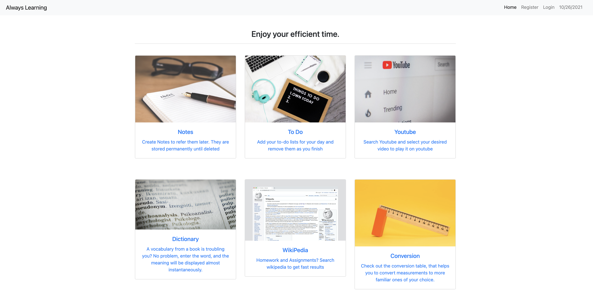

# Always-Learning 


<p align="center">
  
</p>

## ⚡ Features

🎯 **Adding and Deleting Notes**

🎯 **To do List**

🎯 **Search words in Dictionary**

🎯 **Search YouTube Video and Wikipedia**

🎯 **Conversion**

> Many more features that you can explore yourself

## 🚀 Setup

These instructions will get you a copy of the project up and running on your local machine for deployement and development.

You'll need [Git](https://git-scm.com) and [Python 3.8+](https://www.python.org/downloads/) installed on your local computer.

```
python@3.8 or higher
git@2.17.1 or higher
```

## 🔧 How To Use

From your command line, clone and deploy:

```bash
# Clone this repository
$ git clone https://github.com/LiArAu/Always-Learning

# Go into the repository
$ cd Always-Learning

```

## 🛠️ Django Setup

After installing the requirements, we'll need to setup some Django commands.

### Perform database migration:

```bash
python manage.py check
python manage.py migrate
```

### Create Admin Account

> This is the admin account and only this user can login.

```bash
python manage.py createsuperuser
# follow instruction
```

### Create Staff Account

> You can create a group inside admin and make new staff users members in it. Not giving permissions by default is a security feature.

### Run Development Server

```bash
python manage.py runserver
```

Navigate to [http://127.0.0.1:8000](http://127.0.0.1:8000) endpoint in your browser.

Admin endpoint is at http://127.0.0.1:8000/admin/

#### Designed & Developed by [Yajing Li](https://www.github.com/LiArAu)

## Contribute
Found a bug, please [create an issue](https://github.com/LiArAu/Always-Learning/issues/new)
